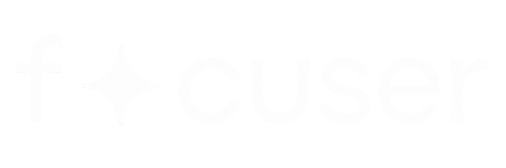

 
  

  &#xa0;

  

  

  

<!-- Status -->

<h4 align="center"> 
	🚧  Focuser em construção...  🚧
</h4> 

<!-- 

  <a href="#dart-about">About</a> &#xa0; | &#xa0; 
  <a href="#sparkles-features">Features</a> &#xa0; | &#xa0;
  <a href="#rocket-technologies">Technologies</a> &#xa0; | &#xa0;
  <a href="#white_check_mark-requirements">Requirements</a> &#xa0; | &#xa0;
  <a href="#checkered_flag-starting">Starting</a> &#xa0; | &#xa0;
  <a href="#memo-license">License</a> &#xa0; | &#xa0;
  <a href="https://github.com/{{akoows}}" target="_blank">Author</a>

 

## :dart: About ##

Describe your project

## :sparkles: Features ##

:heavy_check_mark: Feature 1;\
:heavy_check_mark: Feature 2;\
:heavy_check_mark: Feature 3;

## :rocket: Technologies ##

The following tools were used in this project:

- [Node.js](https://nodejs.org/en/)
-->
## :memo: License ##

Este projeto está sob a licença do MIT, para mais detalhes veja o [LICENSE](LICENSE.md).

Feito pela equipe com :heart: para o Trabalho de Conclusão de Curso.

&#xa0;
